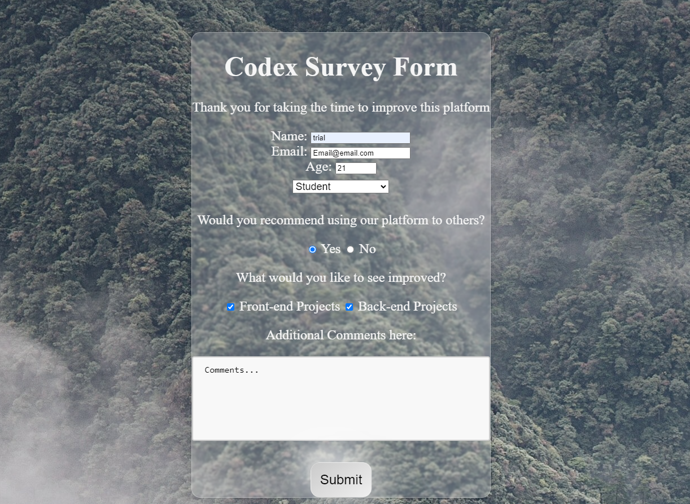

# Survey-Form-
Free Code Camp Project Survey Form
  

- The motivation behind this project was to become more familiar with form building and completetion of the Responsive Web Design Certification 
 
- I built this project to advance my skills with working building forms.

- This project resolves around creating and having a user fill out a survey form. In order for this project to be marked as complete I had to run tests and make sure I added every element wanted.   

- Completion of this project allowed for me to become more knowledgeable with form building and html verification. 

# Installation
In order to install my project, you will need the following

- Git / GitHub Desktop
- IDE with HTML/CSS/JS capabilities 

To start: 
Clone the repository on GitHub then open Git on your local machine. First find a location of your choice on your computer that you want the folder to be in.
- To change working directory, use the command cd followed by a folder or cd.. to move back  
- Using the command git clone and adding the cloned directory, you will have a copy of this project
- To deploy to your ide type code. 

# Usage 
The purpose of this project is for the completion of the Responsive Web Design Certification  

# Deployed Site 
https://wixkedluck.github.io/Survey-Form-/
